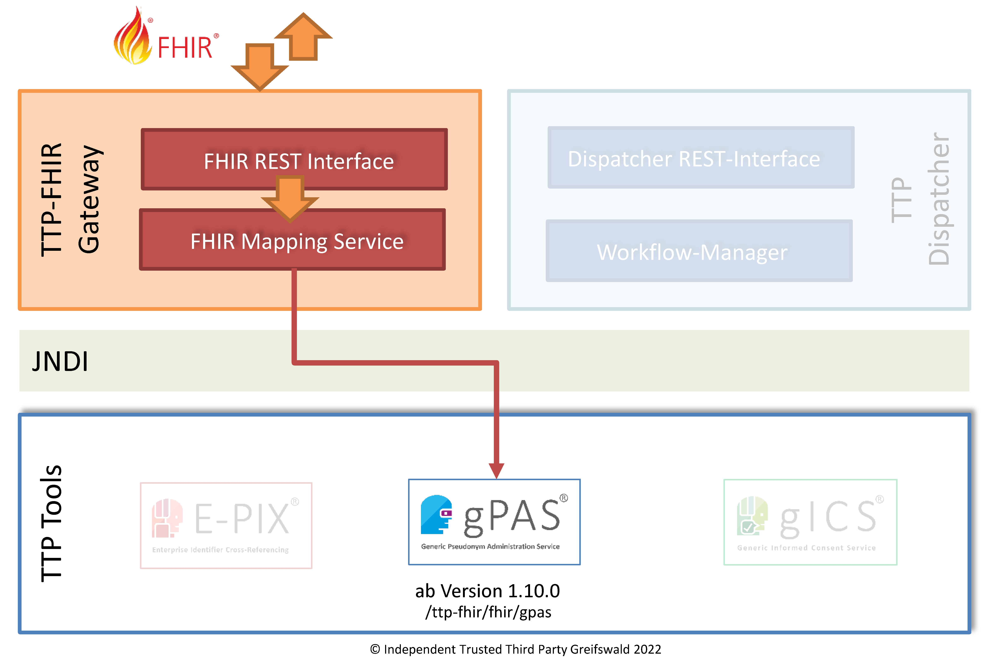

# Implementation Guide gPAS - v2026.2.0

  

 
 2026.2.0 - ci-build  

* [**Table of Contents**](toc.md)
* **Implementation Guide gPAS**

## Implementation Guide gPAS

| | |
| :--- | :--- |
| *Official URL*:https://ths-greifswald.de/fhir/gpas/ImplementationGuide/ths-greifswald.ttp-fhir-gw.gpas | *Version*:2026.2.0 |
| Active as of 2026-10-06 | *Computable Name*:IGTTPFHIRGatewaygPAS |

# FHIR-Support für Pseudonymmanagement

Stand 06.10.2026

Die Softwarelösungen E-PIX, gPAS und gICS werden in zahlreichen Forschungseinrichtungen und Projekten für die Realisierung von Treuhandstellen-Services (THS) eingesetzt. Um die Verwendung dieser Lösungen in FHIR-basierten Infrastrukturen zu unterstützen, werden ausgewählte THS-Funktionalitäten in durch FHIR-basierte Operations, Profile, Erweiterungen und Terminologien realisiert.

Diese werden in entsprechenden [Implementierungsleitfäden](https://www.ths-greifswald.de/fhir) themenspezifisch beschrieben und zahlreiche Details erläutert.

Der vorliegende **Implementation Guide gPAS** setzt den Fokus auf Operations, CodeSysteme und ValueSets von [gPAS].

### Endpunkt

Der FHIR-Endpunkt (`base`) für das Pseudonymmanagement ist

**`http[s]://\<host\>:\<port\>/ttp-fhir/fhir/gpas`**

  

### Package

Das automatisch erzeugte Package (TGZ) steht als Download zur Verfügung unter: [Link](package.tgz).

### Implementierung

Peter Penndorf, Martin Bialke, Christoper Hampf, Frank Michael Moser

### Autoren

Martin Bialke, Stefan Lang

### Kontakt

kontakt-ths (at) med.uni-greifswald.de


## Resource Content

```json
{
  "resourceType" : "ImplementationGuide",
  "id" : "ths-greifswald.ttp-fhir-gw.gpas",
  "url" : "https://ths-greifswald.de/fhir/gpas/ImplementationGuide/ths-greifswald.ttp-fhir-gw.gpas",
  "version" : "2026.2.0",
  "name" : "IGTTPFHIRGatewaygPAS",
  "status" : "active",
  "date" : "2026-10-06T14:31:19+00:00",
  "publisher" : "Unabhängige Treuhandstelle der Universitätsmedizin Greifswald",
  "contact" : [{
    "name" : "Unabhängige Treuhandstelle der Universitätsmedizin Greifswald",
    "telecom" : [{
      "system" : "url",
      "value" : "https://www.ths-greifswald.de/"
    }]
  }],
  "packageId" : "ths-greifswald.ttp-fhir-gw.gpas",
  "license" : "CC0-1.0",
  "fhirVersion" : ["4.0.1"],
  "dependsOn" : [{
    "id" : "hl7tx",
    "extension" : [{
      "url" : "http://hl7.org/fhir/tools/StructureDefinition/implementationguide-dependency-comment",
      "valueMarkdown" : "Automatically added as a dependency - all IGs depend on HL7 Terminology"
    }],
    "uri" : "http://terminology.hl7.org/ImplementationGuide/hl7.terminology",
    "packageId" : "hl7.terminology.r4",
    "version" : "7.4.0"
  },
  {
    "id" : "hl7ext",
    "extension" : [{
      "url" : "http://hl7.org/fhir/tools/StructureDefinition/implementationguide-dependency-comment",
      "valueMarkdown" : "Automatically added as a dependency - all IGs depend on the HL7 Extension Pack"
    }],
    "uri" : "http://hl7.org/fhir/extensions/ImplementationGuide/hl7.fhir.uv.extensions",
    "packageId" : "hl7.fhir.uv.extensions.r4",
    "version" : "5.3.0"
  }],
  "definition" : {
    "extension" : [{
      "extension" : [{
        "url" : "code",
        "valueString" : "copyrightyear"
      },
      {
        "url" : "value",
        "valueString" : "2021+"
      }],
      "url" : "http://hl7.org/fhir/tools/StructureDefinition/ig-parameter"
    },
    {
      "extension" : [{
        "url" : "code",
        "valueString" : "releaselabel"
      },
      {
        "url" : "value",
        "valueString" : "ci-build"
      }],
      "url" : "http://hl7.org/fhir/tools/StructureDefinition/ig-parameter"
    },
    {
      "extension" : [{
        "url" : "code",
        "valueString" : "autoload-resources"
      },
      {
        "url" : "value",
        "valueString" : "true"
      }],
      "url" : "http://hl7.org/fhir/tools/StructureDefinition/ig-parameter"
    },
    {
      "extension" : [{
        "url" : "code",
        "valueString" : "path-liquid"
      },
      {
        "url" : "value",
        "valueString" : "template/liquid"
      }],
      "url" : "http://hl7.org/fhir/tools/StructureDefinition/ig-parameter"
    },
    {
      "extension" : [{
        "url" : "code",
        "valueString" : "path-liquid"
      },
      {
        "url" : "value",
        "valueString" : "input/liquid"
      }],
      "url" : "http://hl7.org/fhir/tools/StructureDefinition/ig-parameter"
    },
    {
      "extension" : [{
        "url" : "code",
        "valueString" : "path-qa"
      },
      {
        "url" : "value",
        "valueString" : "temp/qa"
      }],
      "url" : "http://hl7.org/fhir/tools/StructureDefinition/ig-parameter"
    },
    {
      "extension" : [{
        "url" : "code",
        "valueString" : "path-temp"
      },
      {
        "url" : "value",
        "valueString" : "temp/pages"
      }],
      "url" : "http://hl7.org/fhir/tools/StructureDefinition/ig-parameter"
    },
    {
      "extension" : [{
        "url" : "code",
        "valueString" : "path-output"
      },
      {
        "url" : "value",
        "valueString" : "output"
      }],
      "url" : "http://hl7.org/fhir/tools/StructureDefinition/ig-parameter"
    },
    {
      "extension" : [{
        "url" : "code",
        "valueString" : "path-suppressed-warnings"
      },
      {
        "url" : "value",
        "valueString" : "input/ignoreWarnings.txt"
      }],
      "url" : "http://hl7.org/fhir/tools/StructureDefinition/ig-parameter"
    },
    {
      "extension" : [{
        "url" : "code",
        "valueString" : "path-history"
      },
      {
        "url" : "value",
        "valueString" : "https://ths-greifswald.de/fhir/gpas/history.html"
      }],
      "url" : "http://hl7.org/fhir/tools/StructureDefinition/ig-parameter"
    },
    {
      "extension" : [{
        "url" : "code",
        "valueString" : "template-html"
      },
      {
        "url" : "value",
        "valueString" : "template-page.html"
      }],
      "url" : "http://hl7.org/fhir/tools/StructureDefinition/ig-parameter"
    },
    {
      "extension" : [{
        "url" : "code",
        "valueString" : "template-md"
      },
      {
        "url" : "value",
        "valueString" : "template-page-md.html"
      }],
      "url" : "http://hl7.org/fhir/tools/StructureDefinition/ig-parameter"
    },
    {
      "extension" : [{
        "url" : "code",
        "valueString" : "apply-contact"
      },
      {
        "url" : "value",
        "valueString" : "true"
      }],
      "url" : "http://hl7.org/fhir/tools/StructureDefinition/ig-parameter"
    },
    {
      "extension" : [{
        "url" : "code",
        "valueString" : "apply-context"
      },
      {
        "url" : "value",
        "valueString" : "true"
      }],
      "url" : "http://hl7.org/fhir/tools/StructureDefinition/ig-parameter"
    },
    {
      "extension" : [{
        "url" : "code",
        "valueString" : "apply-copyright"
      },
      {
        "url" : "value",
        "valueString" : "true"
      }],
      "url" : "http://hl7.org/fhir/tools/StructureDefinition/ig-parameter"
    },
    {
      "extension" : [{
        "url" : "code",
        "valueString" : "apply-jurisdiction"
      },
      {
        "url" : "value",
        "valueString" : "true"
      }],
      "url" : "http://hl7.org/fhir/tools/StructureDefinition/ig-parameter"
    },
    {
      "extension" : [{
        "url" : "code",
        "valueString" : "apply-license"
      },
      {
        "url" : "value",
        "valueString" : "true"
      }],
      "url" : "http://hl7.org/fhir/tools/StructureDefinition/ig-parameter"
    },
    {
      "extension" : [{
        "url" : "code",
        "valueString" : "apply-publisher"
      },
      {
        "url" : "value",
        "valueString" : "true"
      }],
      "url" : "http://hl7.org/fhir/tools/StructureDefinition/ig-parameter"
    },
    {
      "extension" : [{
        "url" : "code",
        "valueString" : "apply-version"
      },
      {
        "url" : "value",
        "valueString" : "true"
      }],
      "url" : "http://hl7.org/fhir/tools/StructureDefinition/ig-parameter"
    },
    {
      "extension" : [{
        "url" : "code",
        "valueString" : "apply-wg"
      },
      {
        "url" : "value",
        "valueString" : "true"
      }],
      "url" : "http://hl7.org/fhir/tools/StructureDefinition/ig-parameter"
    },
    {
      "extension" : [{
        "url" : "code",
        "valueString" : "active-tables"
      },
      {
        "url" : "value",
        "valueString" : "true"
      }],
      "url" : "http://hl7.org/fhir/tools/StructureDefinition/ig-parameter"
    },
    {
      "extension" : [{
        "url" : "code",
        "valueString" : "fmm-definition"
      },
      {
        "url" : "value",
        "valueString" : "http://hl7.org/fhir/versions.html#maturity"
      }],
      "url" : "http://hl7.org/fhir/tools/StructureDefinition/ig-parameter"
    },
    {
      "extension" : [{
        "url" : "code",
        "valueString" : "propagate-status"
      },
      {
        "url" : "value",
        "valueString" : "true"
      }],
      "url" : "http://hl7.org/fhir/tools/StructureDefinition/ig-parameter"
    },
    {
      "extension" : [{
        "url" : "code",
        "valueString" : "excludelogbinaryformat"
      },
      {
        "url" : "value",
        "valueString" : "true"
      }],
      "url" : "http://hl7.org/fhir/tools/StructureDefinition/ig-parameter"
    },
    {
      "extension" : [{
        "url" : "code",
        "valueString" : "tabbed-snapshots"
      },
      {
        "url" : "value",
        "valueString" : "true"
      }],
      "url" : "http://hl7.org/fhir/tools/StructureDefinition/ig-parameter"
    },
    {
      "url" : "http://hl7.org/fhir/tools/StructureDefinition/ig-internal-dependency",
      "valueCode" : "hl7.fhir.uv.tools.r4#1.1.2"
    },
    {
      "extension" : [{
        "url" : "code",
        "valueCode" : "copyrightyear"
      },
      {
        "url" : "value",
        "valueString" : "2021+"
      }],
      "url" : "http://hl7.org/fhir/tools/StructureDefinition/ig-parameter"
    },
    {
      "extension" : [{
        "url" : "code",
        "valueCode" : "releaselabel"
      },
      {
        "url" : "value",
        "valueString" : "ci-build"
      }],
      "url" : "http://hl7.org/fhir/tools/StructureDefinition/ig-parameter"
    },
    {
      "extension" : [{
        "url" : "code",
        "valueCode" : "autoload-resources"
      },
      {
        "url" : "value",
        "valueString" : "true"
      }],
      "url" : "http://hl7.org/fhir/tools/StructureDefinition/ig-parameter"
    },
    {
      "extension" : [{
        "url" : "code",
        "valueCode" : "path-liquid"
      },
      {
        "url" : "value",
        "valueString" : "template/liquid"
      }],
      "url" : "http://hl7.org/fhir/tools/StructureDefinition/ig-parameter"
    },
    {
      "extension" : [{
        "url" : "code",
        "valueCode" : "path-liquid"
      },
      {
        "url" : "value",
        "valueString" : "input/liquid"
      }],
      "url" : "http://hl7.org/fhir/tools/StructureDefinition/ig-parameter"
    },
    {
      "extension" : [{
        "url" : "code",
        "valueCode" : "path-qa"
      },
      {
        "url" : "value",
        "valueString" : "temp/qa"
      }],
      "url" : "http://hl7.org/fhir/tools/StructureDefinition/ig-parameter"
    },
    {
      "extension" : [{
        "url" : "code",
        "valueCode" : "path-temp"
      },
      {
        "url" : "value",
        "valueString" : "temp/pages"
      }],
      "url" : "http://hl7.org/fhir/tools/StructureDefinition/ig-parameter"
    },
    {
      "extension" : [{
        "url" : "code",
        "valueCode" : "path-output"
      },
      {
        "url" : "value",
        "valueString" : "output"
      }],
      "url" : "http://hl7.org/fhir/tools/StructureDefinition/ig-parameter"
    },
    {
      "extension" : [{
        "url" : "code",
        "valueCode" : "path-suppressed-warnings"
      },
      {
        "url" : "value",
        "valueString" : "input/ignoreWarnings.txt"
      }],
      "url" : "http://hl7.org/fhir/tools/StructureDefinition/ig-parameter"
    },
    {
      "extension" : [{
        "url" : "code",
        "valueCode" : "path-history"
      },
      {
        "url" : "value",
        "valueString" : "https://ths-greifswald.de/fhir/gpas/history.html"
      }],
      "url" : "http://hl7.org/fhir/tools/StructureDefinition/ig-parameter"
    },
    {
      "extension" : [{
        "url" : "code",
        "valueCode" : "template-html"
      },
      {
        "url" : "value",
        "valueString" : "template-page.html"
      }],
      "url" : "http://hl7.org/fhir/tools/StructureDefinition/ig-parameter"
    },
    {
      "extension" : [{
        "url" : "code",
        "valueCode" : "template-md"
      },
      {
        "url" : "value",
        "valueString" : "template-page-md.html"
      }],
      "url" : "http://hl7.org/fhir/tools/StructureDefinition/ig-parameter"
    },
    {
      "extension" : [{
        "url" : "code",
        "valueCode" : "apply-contact"
      },
      {
        "url" : "value",
        "valueString" : "true"
      }],
      "url" : "http://hl7.org/fhir/tools/StructureDefinition/ig-parameter"
    },
    {
      "extension" : [{
        "url" : "code",
        "valueCode" : "apply-context"
      },
      {
        "url" : "value",
        "valueString" : "true"
      }],
      "url" : "http://hl7.org/fhir/tools/StructureDefinition/ig-parameter"
    },
    {
      "extension" : [{
        "url" : "code",
        "valueCode" : "apply-copyright"
      },
      {
        "url" : "value",
        "valueString" : "true"
      }],
      "url" : "http://hl7.org/fhir/tools/StructureDefinition/ig-parameter"
    },
    {
      "extension" : [{
        "url" : "code",
        "valueCode" : "apply-jurisdiction"
      },
      {
        "url" : "value",
        "valueString" : "true"
      }],
      "url" : "http://hl7.org/fhir/tools/StructureDefinition/ig-parameter"
    },
    {
      "extension" : [{
        "url" : "code",
        "valueCode" : "apply-license"
      },
      {
        "url" : "value",
        "valueString" : "true"
      }],
      "url" : "http://hl7.org/fhir/tools/StructureDefinition/ig-parameter"
    },
    {
      "extension" : [{
        "url" : "code",
        "valueCode" : "apply-publisher"
      },
      {
        "url" : "value",
        "valueString" : "true"
      }],
      "url" : "http://hl7.org/fhir/tools/StructureDefinition/ig-parameter"
    },
    {
      "extension" : [{
        "url" : "code",
        "valueCode" : "apply-version"
      },
      {
        "url" : "value",
        "valueString" : "true"
      }],
      "url" : "http://hl7.org/fhir/tools/StructureDefinition/ig-parameter"
    },
    {
      "extension" : [{
        "url" : "code",
        "valueCode" : "apply-wg"
      },
      {
        "url" : "value",
        "valueString" : "true"
      }],
      "url" : "http://hl7.org/fhir/tools/StructureDefinition/ig-parameter"
    },
    {
      "extension" : [{
        "url" : "code",
        "valueCode" : "active-tables"
      },
      {
        "url" : "value",
        "valueString" : "true"
      }],
      "url" : "http://hl7.org/fhir/tools/StructureDefinition/ig-parameter"
    },
    {
      "extension" : [{
        "url" : "code",
        "valueCode" : "fmm-definition"
      },
      {
        "url" : "value",
        "valueString" : "http://hl7.org/fhir/versions.html#maturity"
      }],
      "url" : "http://hl7.org/fhir/tools/StructureDefinition/ig-parameter"
    },
    {
      "extension" : [{
        "url" : "code",
        "valueCode" : "propagate-status"
      },
      {
        "url" : "value",
        "valueString" : "true"
      }],
      "url" : "http://hl7.org/fhir/tools/StructureDefinition/ig-parameter"
    },
    {
      "extension" : [{
        "url" : "code",
        "valueCode" : "excludelogbinaryformat"
      },
      {
        "url" : "value",
        "valueString" : "true"
      }],
      "url" : "http://hl7.org/fhir/tools/StructureDefinition/ig-parameter"
    },
    {
      "extension" : [{
        "url" : "code",
        "valueCode" : "tabbed-snapshots"
      },
      {
        "url" : "value",
        "valueString" : "true"
      }],
      "url" : "http://hl7.org/fhir/tools/StructureDefinition/ig-parameter"
    }],
    "resource" : [{
      "extension" : [{
        "url" : "http://hl7.org/fhir/tools/StructureDefinition/resource-information",
        "valueString" : "OperationDefinition"
      },
      {
        "url" : "http://hl7.org/fhir/StructureDefinition/implementationguide-page",
        "valueUri" : "OperationDefinition-AnonymizeOriginals.html"
      }],
      "reference" : {
        "reference" : "OperationDefinition/AnonymizeOriginals"
      },
      "name" : "anonymizeOriginals",
      "description" : "Anonymisiert eine gegebene Liste von 1-n Originalwerten innerhalb der angegebenen Domäne. Dabei wird der Bezug von Originalwert und Pseudonym dauerhaft únd irreversibel gelöscht.",
      "exampleBoolean" : false
    },
    {
      "extension" : [{
        "url" : "http://hl7.org/fhir/tools/StructureDefinition/resource-information",
        "valueString" : "OperationDefinition"
      },
      {
        "url" : "http://hl7.org/fhir/StructureDefinition/implementationguide-page",
        "valueUri" : "OperationDefinition-DeletePseudonyms.html"
      }],
      "reference" : {
        "reference" : "OperationDefinition/DeletePseudonyms"
      },
      "name" : "deletePseudonyms",
      "description" : "Löscht eine gegebene Liste von 1-n Einträgen (identifiziert durch den Originalwert) in der angegebenen Domäne, sofern die Konfiguration dieser Domäne dies erlaubt.",
      "exampleBoolean" : false
    },
    {
      "extension" : [{
        "url" : "http://hl7.org/fhir/tools/StructureDefinition/resource-information",
        "valueString" : "OperationDefinition"
      },
      {
        "url" : "http://hl7.org/fhir/StructureDefinition/implementationguide-page",
        "valueUri" : "OperationDefinition-DePseudonymize.html"
      }],
      "reference" : {
        "reference" : "OperationDefinition/DePseudonymize"
      },
      "name" : "dePseudonymize",
      "description" : "Abfrage je eines Originalwertes für eine Liste von 1-n Pseudonymen und eine spezifische Domäne.",
      "exampleBoolean" : false
    },
    {
      "extension" : [{
        "url" : "http://hl7.org/fhir/tools/StructureDefinition/resource-information",
        "valueString" : "OperationDefinition"
      },
      {
        "url" : "http://hl7.org/fhir/StructureDefinition/implementationguide-page",
        "valueUri" : "OperationDefinition-InsertValuePseudonymPairs.html"
      }],
      "reference" : {
        "reference" : "OperationDefinition/InsertValuePseudonymPairs"
      },
      "name" : "insertValuePseudonymPairs",
      "description" : "Fügt ein Wertepaar bestehend aus Originalwert und Pseudonym in eine vorkonfigurierte Domäne ein, z.B. für die Migration von Bestandspseudonymen",
      "exampleBoolean" : false
    },
    {
      "extension" : [{
        "url" : "http://hl7.org/fhir/tools/StructureDefinition/resource-information",
        "valueString" : "Parameters"
      },
      {
        "url" : "http://hl7.org/fhir/StructureDefinition/implementationguide-page",
        "valueUri" : "Parameters-Parameters-AnonymizeOriginals-request-example-1.html"
      }],
      "reference" : {
        "reference" : "Parameters/Parameters-AnonymizeOriginals-request-example-1"
      },
      "name" : "Parameters-AnonymizeOriginals-request-example-1",
      "exampleBoolean" : true
    },
    {
      "extension" : [{
        "url" : "http://hl7.org/fhir/tools/StructureDefinition/resource-information",
        "valueString" : "Parameters"
      },
      {
        "url" : "http://hl7.org/fhir/StructureDefinition/implementationguide-page",
        "valueUri" : "Parameters-Parameters-AnonymizeOriginals-response-example-1.html"
      }],
      "reference" : {
        "reference" : "Parameters/Parameters-AnonymizeOriginals-response-example-1"
      },
      "name" : "Parameters-AnonymizeOriginals-response-example-1",
      "exampleBoolean" : true
    },
    {
      "extension" : [{
        "url" : "http://hl7.org/fhir/tools/StructureDefinition/resource-information",
        "valueString" : "Parameters"
      },
      {
        "url" : "http://hl7.org/fhir/StructureDefinition/implementationguide-page",
        "valueUri" : "Parameters-Parameters-DeletePseudonyms-request-example-1.html"
      }],
      "reference" : {
        "reference" : "Parameters/Parameters-DeletePseudonyms-request-example-1"
      },
      "name" : "Parameters-DeletePseudonyms-request-example-1",
      "exampleBoolean" : true
    },
    {
      "extension" : [{
        "url" : "http://hl7.org/fhir/tools/StructureDefinition/resource-information",
        "valueString" : "Parameters"
      },
      {
        "url" : "http://hl7.org/fhir/StructureDefinition/implementationguide-page",
        "valueUri" : "Parameters-Parameters-DeletePseudonyms-response-example-1.html"
      }],
      "reference" : {
        "reference" : "Parameters/Parameters-DeletePseudonyms-response-example-1"
      },
      "name" : "Parameters-DeletePseudonyms-response-example-1",
      "exampleBoolean" : true
    },
    {
      "extension" : [{
        "url" : "http://hl7.org/fhir/tools/StructureDefinition/resource-information",
        "valueString" : "Parameters"
      },
      {
        "url" : "http://hl7.org/fhir/StructureDefinition/implementationguide-page",
        "valueUri" : "Parameters-Parameters-DePseudonymize-request-example-1.html"
      }],
      "reference" : {
        "reference" : "Parameters/Parameters-DePseudonymize-request-example-1"
      },
      "name" : "Parameters-DePseudonymize-request-example-1",
      "exampleBoolean" : true
    },
    {
      "extension" : [{
        "url" : "http://hl7.org/fhir/tools/StructureDefinition/resource-information",
        "valueString" : "Parameters"
      },
      {
        "url" : "http://hl7.org/fhir/StructureDefinition/implementationguide-page",
        "valueUri" : "Parameters-Parameters-DePseudonymize-response-example-1.html"
      }],
      "reference" : {
        "reference" : "Parameters/Parameters-DePseudonymize-response-example-1"
      },
      "name" : "Parameters-DePseudonymize-response-example-1",
      "exampleBoolean" : true
    },
    {
      "extension" : [{
        "url" : "http://hl7.org/fhir/tools/StructureDefinition/resource-information",
        "valueString" : "Parameters"
      },
      {
        "url" : "http://hl7.org/fhir/StructureDefinition/implementationguide-page",
        "valueUri" : "Parameters-Parameters-DePseudonymize-response-example-2.html"
      }],
      "reference" : {
        "reference" : "Parameters/Parameters-DePseudonymize-response-example-2"
      },
      "name" : "Parameters-DePseudonymize-response-example-2",
      "exampleBoolean" : true
    },
    {
      "extension" : [{
        "url" : "http://hl7.org/fhir/tools/StructureDefinition/resource-information",
        "valueString" : "Parameters"
      },
      {
        "url" : "http://hl7.org/fhir/StructureDefinition/implementationguide-page",
        "valueUri" : "Parameters-Parameters-InsertValuePseudonymPairs-request-example-1.html"
      }],
      "reference" : {
        "reference" : "Parameters/Parameters-InsertValuePseudonymPairs-request-example-1"
      },
      "name" : "Parameters-InsertValuePseudonymPairs-request-example-1",
      "exampleBoolean" : true
    },
    {
      "extension" : [{
        "url" : "http://hl7.org/fhir/tools/StructureDefinition/resource-information",
        "valueString" : "Parameters"
      },
      {
        "url" : "http://hl7.org/fhir/StructureDefinition/implementationguide-page",
        "valueUri" : "Parameters-Parameters-InsertValuePseudonymPairs-response-example-1.html"
      }],
      "reference" : {
        "reference" : "Parameters/Parameters-InsertValuePseudonymPairs-response-example-1"
      },
      "name" : "Parameters-InsertValuePseudonymPairs-response-example-1",
      "exampleBoolean" : true
    },
    {
      "extension" : [{
        "url" : "http://hl7.org/fhir/tools/StructureDefinition/resource-information",
        "valueString" : "Parameters"
      },
      {
        "url" : "http://hl7.org/fhir/StructureDefinition/implementationguide-page",
        "valueUri" : "Parameters-Parameters-InsertValuePseudonymPairs-response-example-2.html"
      }],
      "reference" : {
        "reference" : "Parameters/Parameters-InsertValuePseudonymPairs-response-example-2"
      },
      "name" : "Parameters-InsertValuePseudonymPairs-response-example-2",
      "exampleBoolean" : true
    },
    {
      "extension" : [{
        "url" : "http://hl7.org/fhir/tools/StructureDefinition/resource-information",
        "valueString" : "Parameters"
      },
      {
        "url" : "http://hl7.org/fhir/StructureDefinition/implementationguide-page",
        "valueUri" : "Parameters-Parameters-Pseudonymize-request-example-1.html"
      }],
      "reference" : {
        "reference" : "Parameters/Parameters-Pseudonymize-request-example-1"
      },
      "name" : "Parameters-Pseudonymize-request-example-1",
      "exampleBoolean" : true
    },
    {
      "extension" : [{
        "url" : "http://hl7.org/fhir/tools/StructureDefinition/resource-information",
        "valueString" : "Parameters"
      },
      {
        "url" : "http://hl7.org/fhir/StructureDefinition/implementationguide-page",
        "valueUri" : "Parameters-Parameters-Pseudonymize-response-example-1.html"
      }],
      "reference" : {
        "reference" : "Parameters/Parameters-Pseudonymize-response-example-1"
      },
      "name" : "Parameters-Pseudonymize-response-example-1",
      "exampleBoolean" : true
    },
    {
      "extension" : [{
        "url" : "http://hl7.org/fhir/tools/StructureDefinition/resource-information",
        "valueString" : "Parameters"
      },
      {
        "url" : "http://hl7.org/fhir/StructureDefinition/implementationguide-page",
        "valueUri" : "Parameters-Parameters-Pseudonymize-response-example-2.html"
      }],
      "reference" : {
        "reference" : "Parameters/Parameters-Pseudonymize-response-example-2"
      },
      "name" : "Parameters-Pseudonymize-response-example-2",
      "exampleBoolean" : true
    },
    {
      "extension" : [{
        "url" : "http://hl7.org/fhir/tools/StructureDefinition/resource-information",
        "valueString" : "Parameters"
      },
      {
        "url" : "http://hl7.org/fhir/StructureDefinition/implementationguide-page",
        "valueUri" : "Parameters-Parameters-PseudonymizeAllowCreate-request-example-1.html"
      }],
      "reference" : {
        "reference" : "Parameters/Parameters-PseudonymizeAllowCreate-request-example-1"
      },
      "name" : "Parameters-PseudonymizeAllowCreate-request-example-1",
      "exampleBoolean" : true
    },
    {
      "extension" : [{
        "url" : "http://hl7.org/fhir/tools/StructureDefinition/resource-information",
        "valueString" : "Parameters"
      },
      {
        "url" : "http://hl7.org/fhir/StructureDefinition/implementationguide-page",
        "valueUri" : "Parameters-Parameters-PseudonymizeAllowCreate-response-example-1.html"
      }],
      "reference" : {
        "reference" : "Parameters/Parameters-PseudonymizeAllowCreate-response-example-1"
      },
      "name" : "Parameters-PseudonymizeAllowCreate-response-example-1",
      "exampleBoolean" : true
    },
    {
      "extension" : [{
        "url" : "http://hl7.org/fhir/tools/StructureDefinition/resource-information",
        "valueString" : "Parameters"
      },
      {
        "url" : "http://hl7.org/fhir/StructureDefinition/implementationguide-page",
        "valueUri" : "Parameters-Parameters-PseudonymizeSecondary-request-example-1.html"
      }],
      "reference" : {
        "reference" : "Parameters/Parameters-PseudonymizeSecondary-request-example-1"
      },
      "name" : "Parameters-PseudonymizeSecondary-request-example-1",
      "exampleBoolean" : true
    },
    {
      "extension" : [{
        "url" : "http://hl7.org/fhir/tools/StructureDefinition/resource-information",
        "valueString" : "Parameters"
      },
      {
        "url" : "http://hl7.org/fhir/StructureDefinition/implementationguide-page",
        "valueUri" : "Parameters-Parameters-PseudonymizeSecondary-response-example-1.html"
      }],
      "reference" : {
        "reference" : "Parameters/Parameters-PseudonymizeSecondary-response-example-1"
      },
      "name" : "Parameters-PseudonymizeSecondary-response-example-1",
      "exampleBoolean" : true
    },
    {
      "extension" : [{
        "url" : "http://hl7.org/fhir/tools/StructureDefinition/resource-information",
        "valueString" : "Parameters"
      },
      {
        "url" : "http://hl7.org/fhir/StructureDefinition/implementationguide-page",
        "valueUri" : "Parameters-Parameters-PseudonymizeSecondary-response-example-2.html"
      }],
      "reference" : {
        "reference" : "Parameters/Parameters-PseudonymizeSecondary-response-example-2"
      },
      "name" : "Parameters-PseudonymizeSecondary-response-example-2",
      "exampleBoolean" : true
    },
    {
      "extension" : [{
        "url" : "http://hl7.org/fhir/tools/StructureDefinition/resource-information",
        "valueString" : "OperationDefinition"
      },
      {
        "url" : "http://hl7.org/fhir/StructureDefinition/implementationguide-page",
        "valueUri" : "OperationDefinition-Pseudonymize.html"
      }],
      "reference" : {
        "reference" : "OperationDefinition/Pseudonymize"
      },
      "name" : "pseudonymize",
      "description" : "Abfrage je eines Pseudonym-Wertes für eine gegebene Liste von 1-n Originalwerten und eine spezifische Domäne.",
      "exampleBoolean" : false
    },
    {
      "extension" : [{
        "url" : "http://hl7.org/fhir/tools/StructureDefinition/resource-information",
        "valueString" : "OperationDefinition"
      },
      {
        "url" : "http://hl7.org/fhir/StructureDefinition/implementationguide-page",
        "valueUri" : "OperationDefinition-PseudonymizeSecondary.html"
      }],
      "reference" : {
        "reference" : "OperationDefinition/PseudonymizeSecondary"
      },
      "name" : "pseudonymize-secondary",
      "description" : "Erzeugung einer spezifischen Anzahl von Pseudonymen in einem vorhandenen Pseudonymisierungskontext bei gleichzeitiger Zuordnung zum übermittelten Originalwert.",
      "exampleBoolean" : false
    },
    {
      "extension" : [{
        "url" : "http://hl7.org/fhir/tools/StructureDefinition/resource-information",
        "valueString" : "OperationDefinition"
      },
      {
        "url" : "http://hl7.org/fhir/StructureDefinition/implementationguide-page",
        "valueUri" : "OperationDefinition-PseudonymizeAllowCreate.html"
      }],
      "reference" : {
        "reference" : "OperationDefinition/PseudonymizeAllowCreate"
      },
      "name" : "pseudonymizeAllowCreate",
      "description" : "Generierung je eines Pseudonyms für eine Liste von Originalwerten und eine spezifische Domäne sofern es noch nicht vorhanden ist. Sofern die Zuordnung Originalwert und Domäne bereits bekannt ist, wird das zugeordnete vorhandene Pseudonym zurückgegeben.",
      "exampleBoolean" : false
    }],
    "page" : {
      "extension" : [{
        "url" : "http://hl7.org/fhir/tools/StructureDefinition/ig-page-name",
        "valueUrl" : "toc.html"
      }],
      "nameUrl" : "toc.html",
      "title" : "Table of Contents",
      "generation" : "html",
      "page" : [{
        "extension" : [{
          "url" : "http://hl7.org/fhir/tools/StructureDefinition/ig-page-name",
          "valueUrl" : "index.html"
        }],
        "nameUrl" : "index.html",
        "title" : "Implementation Guide gPAS",
        "generation" : "markdown"
      },
      {
        "extension" : [{
          "url" : "http://hl7.org/fhir/tools/StructureDefinition/ig-page-name",
          "valueUrl" : "Allgemein.html"
        }],
        "nameUrl" : "Allgemein.html",
        "title" : "Allgemein",
        "generation" : "markdown"
      },
      {
        "extension" : [{
          "url" : "http://hl7.org/fhir/tools/StructureDefinition/ig-page-name",
          "valueUrl" : "Mitgeltend.html"
        }],
        "nameUrl" : "Mitgeltend.html",
        "title" : "Mitgeltende Hinweise",
        "generation" : "markdown"
      }]
    },
    "parameter" : [{
      "code" : "path-resource",
      "value" : "input/capabilities"
    },
    {
      "code" : "path-resource",
      "value" : "input/examples"
    },
    {
      "code" : "path-resource",
      "value" : "input/extensions"
    },
    {
      "code" : "path-resource",
      "value" : "input/models"
    },
    {
      "code" : "path-resource",
      "value" : "input/operations"
    },
    {
      "code" : "path-resource",
      "value" : "input/profiles"
    },
    {
      "code" : "path-resource",
      "value" : "input/resources"
    },
    {
      "code" : "path-resource",
      "value" : "input/vocabulary"
    },
    {
      "code" : "path-resource",
      "value" : "input/maps"
    },
    {
      "code" : "path-resource",
      "value" : "input/testing"
    },
    {
      "code" : "path-resource",
      "value" : "input/history"
    },
    {
      "code" : "path-resource",
      "value" : "fsh-generated/resources"
    },
    {
      "code" : "path-pages",
      "value" : "template/config"
    },
    {
      "code" : "path-pages",
      "value" : "input/images"
    },
    {
      "code" : "path-tx-cache",
      "value" : "input-cache/txcache"
    }]
  }
}

```
